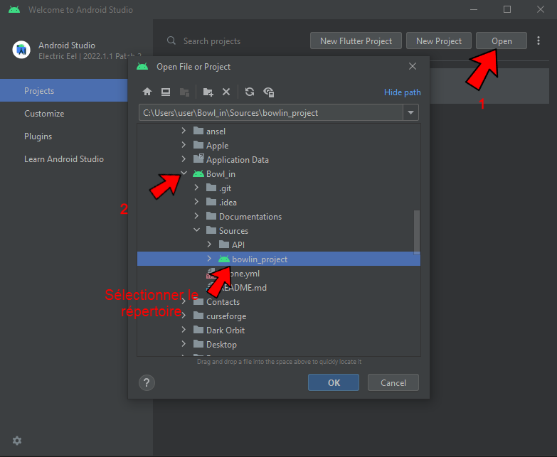
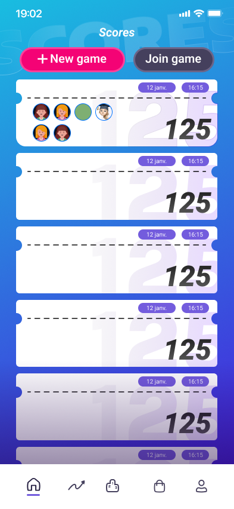
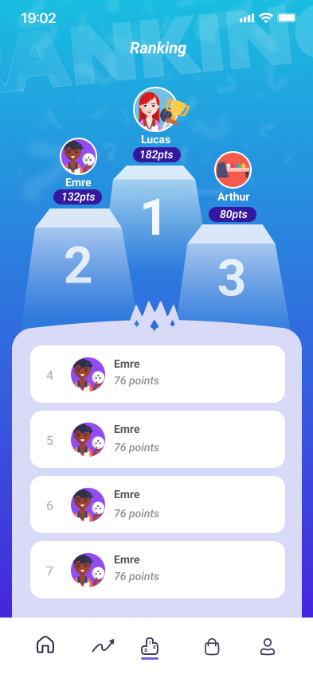
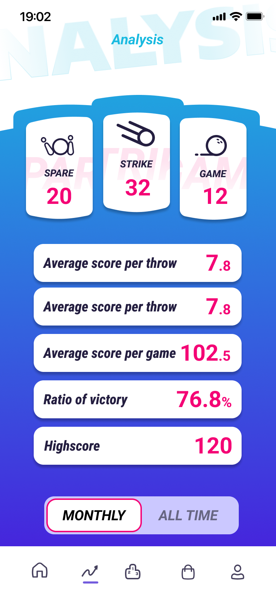
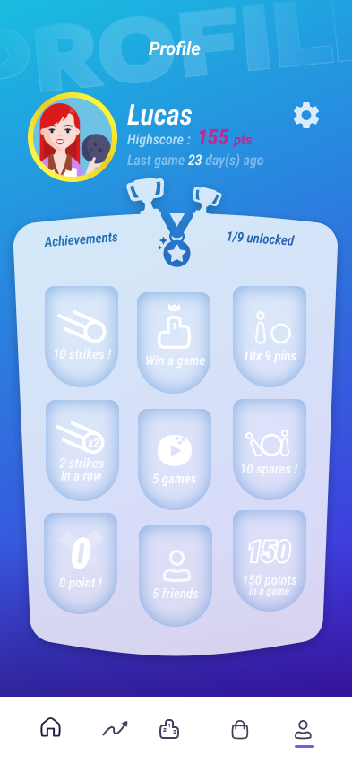

<div align = center>

  
    
</div>
<div align = center>

[Présentation](#présentation) | [Répartion](#répartition-du-gitlab) | [Fonctionnement](#fonctionnement-&#x1F4D1;) | [Deploiement](#deploiement-&#x1F680;) | [Techniciens](#technicien-en-charge-de-l'application) | [Remerciements](#remerciements-&#x1F44B;) | [Wiki](https://codefirst.iut.uca.fr/git/BowlDev/Bowl_in/wiki)

---

&nbsp; 
&nbsp; 
&nbsp; 
&nbsp; 
</br>
[](https://codefirst.iut.uca.fr/sonar/dashboard?id=Bowl_in)
[](https://codefirst.iut.uca.fr/sonar/dashboard?id=Bowl_in)
[](https://codefirst.iut.uca.fr/sonar/dashboard?id=Bowl_in)
[](https://codefirst.iut.uca.fr/sonar/dashboard?id=Bowl_in)
[](https://codefirst.iut.uca.fr/sonar/dashboard?id=Bowl_in)
[](https://codefirst.iut.uca.fr/sonar/dashboard?id=Bowl_in)

---

</div>

## Présentation

**Nom de l'application** : Bowl'in :bowling:

**Contexte** : Quand on fait une partie de bowling, les points sont affichés sur un écran. La majorité des joueurs font une photo de la fiche de scores finale en souvenir plus l'oublient. Par la suite, le degré de mythomanie de chacun sert d'évaluateur subjectif à la prochaine partie ("La dernière fois j'avais fait au moins 130pts"... oui bien sûr...).

**Récapitulation du Projet**: 👇

</br>

:information_source: Une application mobile permettant de saisir les scores de bowling pendant une partie avec possibilité d'obtenir des statistiques (points moyens, classement, etc.) et partage. Mais aussi de rentrer le nom des joueurs et de stocker les résultats.


## Répartition du Gitlab

La racine de notre gitlab est composé de deux dossier essentielles au projet:

[**src**](src) : **Code de l'application**

[**doc**](doc) : **Regroupe l'entièreté  de la documentation**

</br>

:warning: Code de l'application en cours!


## Fonctionnement &#x1F4D1;

- Comment récuperer le projet ?

Tout d'abord, si ce n'est pas déjà fait, clonez le dépôt de la branche **master/main**. Pour cela, copiez l'URL du dépôt Git :

<div align = center>


</div>

En utilisant ce lien, vous pouvez cloner le dépôt soit dans un terminal, soit via Tortoise. Si vous ne savez pas comment faire, vous devez avoir d'abord installer Git for Windows en suivant ce [lien](https://gitforwindows.org/), puis suivre le [tutoriel](https://docs.github.com/fr/repositories/creating-and-managing-repositories/cloning-a-repository))

:information_source: *Si vous n'êtes pas familier avec Git, vous pouvez également télécharger le dépôt au format zip en cliquant simplement sur le bouton situé à droite de l'URL.*


:warning: Maintenant, vient l'étape un peu plus complexe : **Android Studio** !
Avant de pouvoir exécuter l'application, vous devez installer le SDK de Flutter et l'IDE Android Studio. Tout d'abord, rendez-vous sur le site de [Flutter](https://docs.flutter.dev/get-started/install/windows) qui explique en détail comment procéder :heavy_exclamation_mark:

Pour *Android Studio*, vous n'avez qu'à installer l'application en suivant ce [lien](https://developer.android.com/studio) et en suivant les étapes !

Une fois qu'*Android Studio* est installé, il ne vous reste plus qu'à ouvrir le projet que vous avez récupéré préalablement à partir de ce dépôt :

<div align = center>



</div>

Il ne vous reste plus qu'à connecter votre téléphone **Android** (n'oubliez pas d'activer le mode développeur et le débogage USB) ou à utiliser un **émulateur** (je vous invite à regarder une vidéo qui vous explique comment faire si vous ne savez pas) qui est également une option valable, mais il prend beaucoup de place en mémoire :cd:

:information_source: *N'oubliez pas de configurer le lancement de l'application en sélectionnant le fichier [main.dart](Sources/bowlin_project/lib/main.dart)*

- Comment utiliser l'application ?

L'application à été réaliser à un très simple pour n'importe quel utilisateur et se résume en 4 grande pages : 

<div align = center>






</div>

:confounded: Pas de panique, ce n'est pas si compliqué que ça !

Pour la première page, qui est la page **Home** de l'application, nous pouvons lancer des parties ou rejoindre celles de nos amis. Ces parties sont alors répertoriées du plus récent au plus ancien.

La page **Ranking** quant à elle permet d'obtenir un classement entre amis et de savoir quelle personne a obtenu le meilleur score.

Dois-je vraiment expliquer la page d'**analyse** ? Elle permet, comme n'importe quelle page, d'afficher des statistiques sur l'ensemble de vos parties, que ce soit votre ratio de victoires, de spares, etc.

Enfin, la dernière et non des moindres, la page **profil** qui regroupe les informations de votre compte, telles que votre meilleur score, votre dernière connexion... mais aussi les *succès* (plus communément appelés "achievements") que vous avez obtenus au cours de vos parties.

``` Amusez-vous bien !```

## Deploiement &#x1F680;
- [x] &nbsp; 
- [x] &nbsp; 


## Technicien en charge de l'application

- Emre KARTAL : emre.kartal@etu.uca.fr
- Lucas DELANIER : lucas.delanier@etu.uca.fr
- Arthur VALIN : arthur.valin@etu.uca.fr
- David D'ALMEIDA : david.d_almeida@etu.uca.fr
- Louison PARANT : louison.parant@etu.uca.fr

## Remerciements &#x1F44B;

:information_source: Un remerciement chaleureux est adressé à tous ceux qui ont participé à la réalisation du projet, en particulier à M. Chevaldonné et Mme Chatti pour leur aide précieuse.

<div align = center>
© PM2
</div>